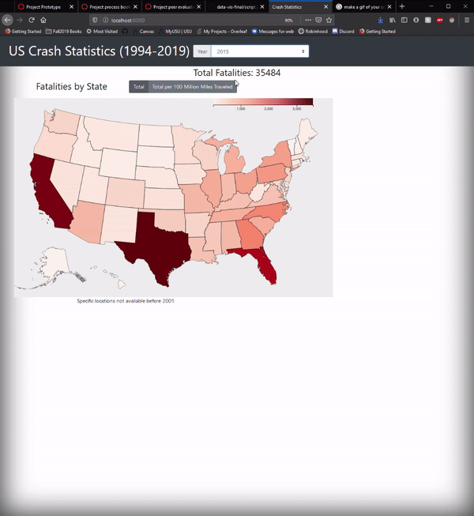
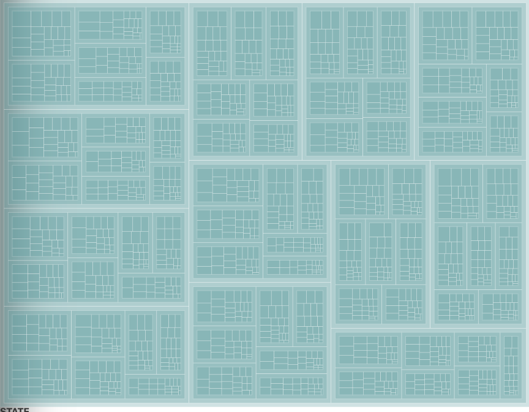
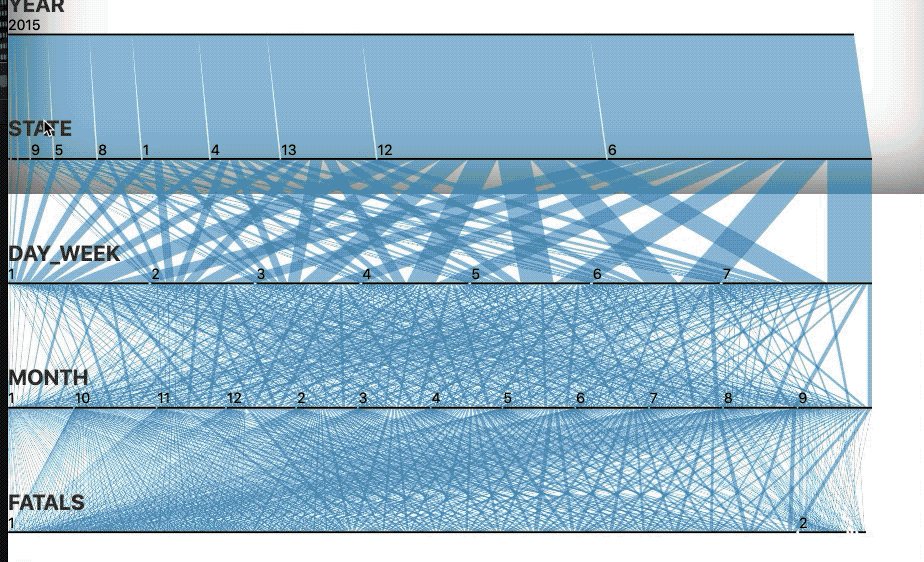

### Two and a Half Beards
Paxton Alexander | A01662255 | paxton.alexander@aggiemail.usu.edu\
Zac Johnson | A01967796 | zacjohnson@aggiemail.usu.edu\
Brady Bodily | A00908787 | brady.bodily1@aggiemail.usu.edu\
https://github.com/zcjhnsn/data-vis-final

# Proposal
## Crash Statistics
### November 5, 2019
#### BACKGROUND & MOTIVATION
Automotive safety is paramount in today’s society. Nearly every car advertisement and commercial mention the vehicle’s safety rating. As automobile safety technology improves, speed limits continue to rise with limits reaching the mid-80s on many western interstates. It would be helpful to know which road systems are most dangerous, which vehicles are safest, and which types of crashes have the best chances of survival. According to the National Safety Council, a person has a 1 in 114 chance of dying in a vehicle accident. We would like to know if that chance has increased with modern technology despite the faster speed limits. The Tesla Model X was the first car in history to receive a perfect five star crash safety rating and did so in 2017. All of us either have been or know someone who has been in an automobile accident, so this data hits close to home.

#### OBJECTIVES
Visualize NHTSA crash datasets to:
Show the safety of modern cars.
Show historical crash survivability by type of collision.
Potentially discover any trends with road/weather conditions and fatalities.
Identify the most deadly states for fatal collisions.

#### DATA
Data will be collected from the NHTSA FARS database. We will download the sets of files that we need as excel sheets for processing.
- https://www.nhtsa.gov/research-data
- https://www-fars.nhtsa.dot.gov/Main/index.aspx
- https://www-fars.nhtsa.dot.gov/States/StatesFatalitiesFatalityRates.aspx
- https://www-fars.nhtsa.dot.gov/Vehicles/VehiclesAllVehicles.aspx
- https://www-fars.nhtsa.dot.gov/Trends/TrendsGeneral.aspx
- And many more...
#### DATA PROCESSING
The data comes in a pretty sanitized format already, so not much cleanup will be needed. We plan to read all the files in as csv files, similar to the format of previous assignments. We mainly want to  compute the difference in crashes/fatalities from 1994 to 2017. This will hopefully let us visualize if driving has become safer.
#### VISUALIZATION DESIGN
The following are examples pulled from the internet that we have used as guidance for our visualizations. We want to be able to visualize on individual state statistics as well as national statistics. This is a similar layout to how we want our main viz to look.
#### 
We want to have an interactive map that allows you to select a state and see various statistics about that state. 
#### 
We really liked the treemap demo from class and want to implement something similar. There are various categories we can use to implement this viz. This is a must have in our final viz.
#### 
We like this viz because it lets you see the various causes of accidents at once. It will be an optional viz.
#### 
This would be a useful viz to allow users to drill down on crashes and see more detailed stats about that specific crash.
#### 
We liked the Titanic viz shown and class and felt it would be very applicable to our dataset.

#### FEATURES
- Must-Have
  - Interactive map with data for each state.
  - Parallel set viz
  - Treemap viz
  - Show crash survivability trends to help determine if car safety has truly improved.
  - Show which types of accidents cause the most fatalities.
- Optional
  - Overlay the map with US highways and encode the path with fatalities highlighting the most deadly areas as well as the most deadly overall highway.
  - Hierarchical Bar Chart allowing users to dig down into specifics about the data.
  - Dot plot

#### MILESTONES
#### Nov. 15, 2019
Have all data downloaded and loading into program.
- Paxton - Get state data loading correctly.
- Zac - Identify which api’s we need to hit to get the data.
- Brady - Get the data loaded into usable objects.
#### Nov. 22, 2019
Have each viz implemented in some fashion. Full interactivity is not necessary at this point.
- Paxton - Get state map rendered.
- Zac - Render the parallel set
- Brady - Have Tree Map rendering.
#### Nov. 29, 2019
Stick all visualizations into a final layout. Finish interactivity of visualizations.
- Paxton - Implement clicking on a state to get stats about that state.
- Zac - Implement basic interactivity (highlighting, rearranging, etc)
- Brady - Implement Sorting and updating Tree Map based on user selection.
#### Dec. 6, 2019
Finishing touches and submission.
- All - Ensure final layout meets our goal.

# Prototype

### Overview and Motivation
We wanted to explore vehicle crashes and fatality rates in the US over the last 25 years. We planned to show this on a national and state level. This visualization can provide insight as to whether driving has become safer in the last 25 years.

### Related Work
The Treemap and Parallel set visualizations from class were two that we knew we wanted to implement. We did have to gather some ideas from websites on good visualizations, but ultimately we are taking our own route.

### Questions
Originally we wanted to see if modern cars had made driving safer. Now we are steering (haha, get it...) towards when and where are accidents the most fatal. This can quickly be answered by our first map visualization. With the Treemap we really want to focus more on the time of year, week, and day. This could potentially find some unexpected trends that would tie into the state and year really well.

### Data
There were a few headaches when gathering our data. Luckily, it was not a lack of data, but an over abundance of data that caused these problems. To get our data we ran a shell script to curl all the datasets to our machine. We then ran these through a python script to combine them into one large dataset.

### Exploratory Data Analysis
We looked at all our data through spreadsheets. We spent all our time just getting it to load into our own visualizations that we didn't get much time to explore others.

### Design Evolution
We attempted a few different variations on the state map. We were going to have it display a table when clicked. That evolved into having it draw the state and display the crashes. Then we ended on having it zoom to a state and draw the crash dots. The Treemap and Parallel set are still a work in progress, so they will likely go through some more iterations of design. One possibility of the Treemap is that we limit the scope to either the selected state, the selected year, or the selected year and selected state. This could be acomplished with a selection tool for just that visualization. The parallel set will need a different data set than the one originally used. The data is refined too much so the lines get very small and it becomes impossible to learn anything from it.

### Implementation
Since we are doing data for the last 25 years, we needed a way for the user to select which year they wanted. This is achieved with a simple dropdown. There is also two buttons that can toggle the data used in the map. The two datasets are total fatalities per state, and total fatalities per 100 million miles traveled. Clicking on a state zooms into that state and shows each individual car crash. Clicking another state will move there. Clicking the selected state or off the map will zoom the map back out.

The Treemap currently shows all of the data passed into it. 

The parallel already has a high level of interactivity. It is similar to the titanic parallel set that we saw in class. The user is able to rearrange all pieces of the parallel set to see how the data is related. This allows for the user to discover new connections than the ones they are initially presented with. The user is also able to highlight certain criterion to better see all the connections.

### Evaluation
We were somewhat surprised at the number of fatalities per year. We had anticipated it to be higher. Viewing by miles also makes quite a difference as to which state is really the deadliest. The state viz works pretty well, it could benefit from optimization however.

We were quickly able to see that the type of data given to the parallel set diagram matters. In the above gif, some datapoints have been sorted to very fine numbers. This is because the month data then splits based on the day of the month. Order matters and, since the user can rearrange the vis at will, a reset button would be good to add. Also, the types of data that we give the parallel set can't have too wide of a range since the chart is nearly impossible to read further down the chart.

There was a bit of a struggle getting the data into a hierarchical data structure for the Treemap. A lot of the documentation is availible for creating Treemaps with previous version however it is sparse for version 5 and there were some significant breaking changes with promises and callbacks.
